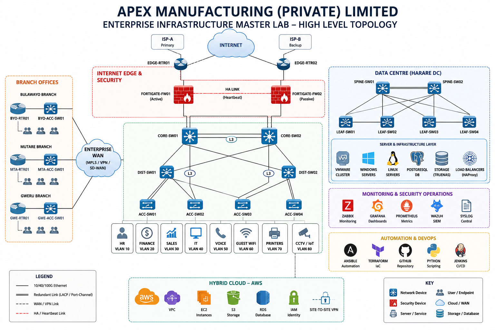

# BETELGEUSE INFRA (PVT) LTD

# High-Level Enterprise Network Topology

| Document Information   | Details                              |
| ---------------------- | ------------------------------------ |
| Project                | Enterprise Infrastructure Master Lab |
| Client                 | Apex Manufacturing (Private) Limited |
| Implementation Partner | Betelgeuse Infra (Pvt) Ltd           |
| Document Owner         | Edmond Chamunorwa                    |
| Version                | 1.0                                  |
| Status                 | Initial Design                       |
| Classification         | Internal                             |

---

# 1. Purpose

This document records the initial high-level topology for the Enterprise Infrastructure Master Lab.

The topology provides a visual representation of the major infrastructure domains that will be implemented throughout the project.

The diagram represents the architectural direction of the environment and will evolve as detailed design and implementation progress.

---

# 2. Topology Diagram

---

# 3. Major Infrastructure Domains

The high-level topology contains the following primary infrastructure domains:

* Internet Edge
* Dual Internet Service Providers
* Enterprise Firewall High Availability
* Core Network
* Distribution Network
* Access Network
* Branch Offices
* Enterprise WAN
* Data Centre
* Server Infrastructure
* Monitoring and Management
* Automation and DevOps
* Hybrid AWS Cloud

---

# 4. Internet Edge

The Internet edge architecture contains two external service-provider paths.

The design includes:

* ISP-A
* ISP-B
* Two enterprise edge routers
* BGP connectivity
* Redundant upstream paths

This architecture is intended to provide resilient Internet connectivity and allow BGP traffic-engineering exercises.

---

# 5. Firewall Layer

The topology contains two FortiGate firewalls operating as an active-passive high-availability pair.

The firewall layer separates external and internal security zones and will eventually provide:

* Network Address Translation
* Security policies
* VPN termination
* Internet security
* DMZ connectivity
* Security inspection
* Logging

---

# 6. Core Layer

The enterprise core consists of two Layer 3 core switches.

The core provides the high-speed routed backbone between major infrastructure domains.

The core design will support:

* Redundant Layer 3 paths
* Dynamic routing
* Equal-cost paths where applicable
* Connectivity toward the firewall
* Connectivity toward distribution
* Connectivity toward the data centre and WAN

---

# 7. Distribution Layer

Two Layer 3 distribution switches provide aggregation between the core and access layers.

The distribution layer will provide services including:

* Inter-VLAN routing
* HSRP or VRRP
* Access-layer aggregation
* Spanning-tree control
* DHCP relay
* Network policy enforcement

---

# 8. Access Layer

The access layer provides endpoint connectivity for enterprise users and devices.

Planned endpoint categories include:

* Human Resources
* Finance
* Sales
* Information Technology
* Voice
* Guest Wireless
* Printers
* CCTV and IoT devices

The environment will use VLAN segmentation to separate these operational functions.

---

# 9. Branch Connectivity

The architecture includes branch infrastructure representing multiple remote business locations.

Each branch will contain:

* Branch router
* Access switch
* User endpoints
* WAN connectivity

Branch communication will eventually use routed WAN, MPLS, VPN and SD-WAN technologies during different project exercises.

---

# 10. Data Centre

The data-centre architecture is logically separated from the traditional campus architecture.

The topology includes:

* Spine switches
* Leaf switches
* VMware infrastructure
* Windows servers
* Linux servers
* PostgreSQL
* Storage
* Load balancing
* Container infrastructure

The data-centre network will later implement VXLAN and EVPN.

---

# 11. Hybrid Cloud

AWS forms the hybrid-cloud extension of the enterprise environment.

Planned services include:

* Amazon VPC
* EC2
* S3
* RDS
* IAM
* VPN connectivity

On-premises infrastructure will eventually connect to AWS through an encrypted Site-to-Site VPN.

---

# 12. Monitoring and Security Operations

The topology includes centralised operational visibility platforms.

Planned technologies include:

* Zabbix
* Grafana
* Prometheus
* Wazuh
* Syslog
* Network scanning
* Traffic analysis

These platforms will provide infrastructure and security visibility.

---

# 13. Automation and DevOps

Infrastructure automation will include:

* Ansible
* Terraform
* GitHub
* Python
* Jenkins where appropriate

These technologies will automate configuration, validation and infrastructure deployment.

---

# 14. Design Principles

The topology is based on the following principles:

* High Availability
* Redundancy
* Security by Design
* Network Segmentation
* Scalability
* Modular Architecture
* Monitoring and Visibility
* Automation
* Hybrid Cloud Integration

---

# 15. Topology Status

This topology represents the initial high-level design.

Detailed topology diagrams will subsequently be created for:

* Campus networking
* WAN
* Internet edge
* Firewall architecture
* Data centre
* Server infrastructure
* Monitoring
* Security
* AWS hybrid cloud
* VXLAN and EVPN

The topology may evolve where implementation testing identifies justified design changes.

All significant changes will be recorded in the project change log.

---

# Revision History

| Version | Date        | Author            | Description                            |
| ------- | ----------- | ----------------- | -------------------------------------- |
| 1.0     | August 2026 | Edmond Chamunorwa | Initial high-level topology registered |
